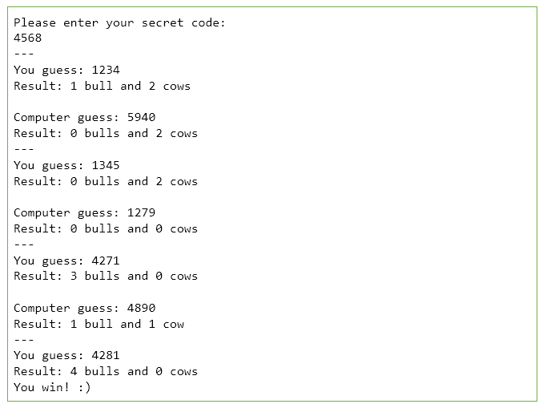
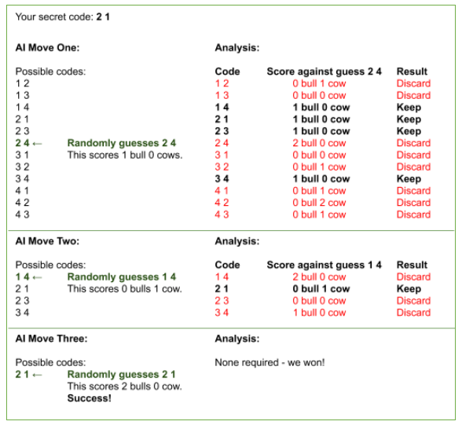
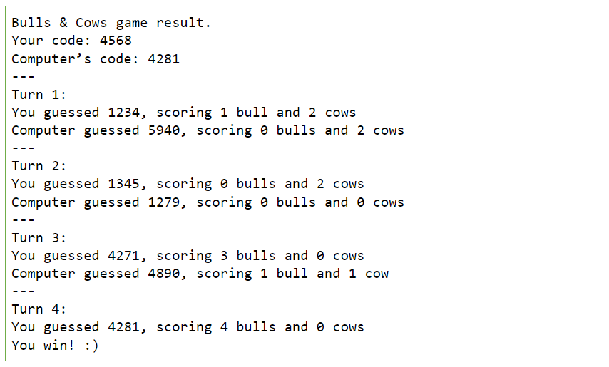

# Bulls & Cows
🐂🐂➕🐄🐄

## Overview
This assignment requires you to develop a simple game called Bulls & Cows.
There are seven compulsory tasks in this assignment to complete, totalling 80 marks worth 10% of final grade.

Before starting the assignment, take time to carefully read through the project instructions and gain an understanding of the requirements.

## Criteria
Your assignment will be marked based on the correctness of your program and your programming style. Here are some questions to consider for the programming style:

* Is the code well-structured?
* Is the code self-explanatory?
* Can you understand the code easily?
* Are all variables properly defined with meaningful and clear code?
* Is there any commented out code?
* Have you formatted your code?

Marks will be deducted if your code cannot be compiled or has bad programming style.

### Git Commit Requirement
You must make a commit + push whenever you complete a feature, and whenever you feel you have achieved a milestone.
This will be used to help monitor your progress on the project, and will also be helpful for you to 
review code changes in the event of [software regressions](https://en.wikipedia.org/wiki/Software_regression).

You must make at least 20 commits in your project. With the following goals for each commit:

- Spend no more than ~30 seconds writing the commit message
- The commit should be meaningful to someone reading your code history
- The changes in the commit should be aimed at solving a particular task, such as:
  - Feature addition
  - Bugfix
  - Improve code quality/readability
  - Documentation
- Commits made just to meet the commit requirement will be ignored
- You should format your code before committing
- At least one commit is required at the completion of Task Two; at least one commit is required at the completion of Task Three; and at least one commit is required at the completion of Task Five

Any submission that does not meet the git commit requirement is subject to a mark of zero, deductions, and a code interview.

## Submission
After completing the assignment, you should have a functional Java program with some number of classes (depending on your own design).
You submit by ensuring your GitHub repository for this assignment is up-to-date. We will download your repository for marking on the due date.

Late submissions are not permitted. You will get a mark of zero if your repository does not contain your submission when we download it.

## Assignment Details
The bulls and cows game is a code-breaking game designed for two or more players. Each player chooses a secret code of 4 digits from 0 to 9. The digits must be all different. The goal of the game is for each player to guess the other player's secret code.

The players in turn present their guesses to the opponents. The opponents respond by telling the players:
1. The number of bulls, i.e. the number of matching digits in their right positions, and
2. The number of cows, i.e. the number of matching digits but in different positions.

For example, if the computer's secret code is 4281, the match responses for the following guesses are shown as follows:

For more information about the game itself can be found [here](https://en.wikipedia.org/wiki/Bulls_and_Cows).

### Requirements
The main goal of this assignment is to develop the bulls and cows game that allows a single player to play interactively against the computer. The game stores two secret codes, one from the player and one from the computer. The player and the computer will try to guess each other’s secret code. Both the player and the computer only have seven attempts for guessing the secret code. If the player enters an invalid input, the game should ask the player to try again. The game also lets the player choose the difficulty level to play against the computer. There are three levels: easy, medium and hard. The details of the difficulty levels will be described in later sections. In addition, the game can save the results to another text file. The game also allows the player to play Wordle.

For this assignment, you'll complete a series of tasks as you work your way towards a fully functional implementation. As you complete each task, it might be a good idea to save a working version of the program at that point.

## Task One: Design and Feedback (10 marks)
For this assignment, there is very little which is already given to you. 
Through this assignment, you'll gain experience in designing and building a complex program from scratch. 
Before starting to code, don't forget to design your classes and methods (i.e. create UML class)!
You should apply the concepts you have learned so far in the course. You should not have everything in one class, 
and try to promote code reuse as much as possible. You must have at least one use of inheritance in this assignment.

### Design communication format
Using either pen & paper or the diagramming tool of your choice, prepare a **UML class diagram** which shows 
all the classes and important methods of your Bulls & Cows implementation, along with the appropriate relationships 
showing how these classes fit together.

In addition, describe the approximate sequence of method calls in your design (game flow)
you can **optionally** draw a sequence diagram to show this, however are welcome to describe in words or any other format.
The purpose is to communicate a rough idea of how your code will translate to console input/outputs to the user.

To get full marks, your UML diagram does not need to be perfect as your design will likely change. You should aim to show:
- all classes that you will create, no internal java class needs to be shown
  - show notable methods
  - show notable instance variables
  - you do not need to show public / private / protected, but are welcome to include
- inheritance relations between subclass and superclass
- implementation relation for interfaces
- associations and dependencies
- you do not need to show aggregation or composite relations, but are welcome to include

You should add your UML diagrams to Git (as a PNG, PDF or JPEG) **before meeting teaching staff**.
You can upload this image to the top level of your Git repository (i.e. where the README is).
You should also upload a document of your choosing to communicate game flow, you can choose a sequence diagram, short paragraphs,
or any other appropriate means.

You can meet teaching staff via Zoom, check canvas announcements and the Canvas Assignment page for the Zoom link & schedule.
If you are unable to meet via Zoom you must have a good reason; if this is the case, requesting feedback on your design 
via email to your lecturer is acceptable.

**To receive full marks for this assignment, you must show your design to one of the teaching staff before the end 
of the first week of semester break for feedback on your design (3rd September).**

You then need to take the feedback into consideration - whether you are going to follow the suggestions or 
you are going with your original design.

Failure to demonstrate your initial design will result in a mark of zero for this assignment.

Note: It is OK if your implementation doesn't match your initial design 100% - things do change!

## Task Two: The Beginning (12 marks)
Implement the first part of the game allowing the player to guess the computer's secret code. The computer randomly generates the secret code at the beginning of the game, which it then lets the player guess. Remember that when generating the computer's secret code, each of the four digits must be different. Note that the player only has seven attempts to guess the secret code. The prompt for player input, results for each guess and the final outcome (i.e. whether the player has won the game or not) should be displayed appropriately to the console.

## Task Three: Easy AI (12 marks)
Modify your code so that the player can now also enter a secret code when the game begins, which the computer must guess. Remember to verify that the player has chosen a valid secret code. The player and computer each take turns guessing the other's code. The game ends when either side successfully guesses the other's code (resulting in a win for that side), or when each side has made seven incorrect guesses (resulting in a draw).

For this task, have the player play against an easy AI. When the AI makes a guess, it will simply generate a random (valid) guess.

## Task Four: Medium AI (4 marks)
Modify your code so that at the beginning of the game (before the player enters their own secret code), they will be asked to select either an easy or medium AI opponent to play against.

If the player chooses to play against an easy AI, the game should proceed in exactly the same manner as in Task Three. However, if a medium AI is selected, the AI should keep track of guesses it has already made. The AI will not make the same guess twice.

## Task Five: Hard AI (15 marks)
Modify your code so that the player can additionally choose to play against a hard AI opponent.

If the player chooses to play against an easy or medium AI, the game should proceed in exactly the same manner as in Task Three or Four. However, if a hard AI is selected, the computer should be much more intelligent when guessing, rather than just choosing at random. One possible strategy for implementing the hard AI is given as follows.

### Possible Strategy
This strategy involves keeping a list of all possible guesses, and then intelligently pruning that list based on the result of each guess made by the AI. In this strategy, the first guess by the computer will be chosen randomly. After this guess, all subsequent guesses will be carefully planned. The computer keeps a track of precisely which codes remain consistent with all the information it has received so far. The computer will only choose a guess that has a chance of being the correct one.

For example, let’s assume the computer’s first guess scored 1 bull and 1 cow. Then the only codes that still have a chance to be the correct one, are those which match up 1 bull and 1 cow with the first guess. All other codes should be eliminated. The computer will go through its list of all possible codes and test each against its first guess. If a code matches 1 bull and 1 cow with the first guess, then it will remember that the code is still a possible candidate for the secret code. If a code does not match 1 bull and 1 cow with the first guess, the code will be eliminated. After this is completed, the computer randomly chooses any of the possible candidates for the second guess.

If the computer’s second guess scored 2 bulls and 1 cow, the computer checks all the remaining candidates to see which codes match up 2 bulls and 1 cow with the second guess. Those codes that do not match are eliminated. In this manner, each guess is consistent with all the information obtained up until that point in the game.

To illustrate the process, consider the scenario shown in the following figure, in which a simpler version of the game is being played. In this demonstration, secret codes are only two digits in length, and may only contain the characters 1 through 4. The player has chosen "2 1" as their secret code, which the AI is trying to guess. Using this process of elimination, the AI is able to quickly guess the player’s code.

## Task Six: Saving to a File (7 marks)
Modify your code so that, when the game ends (win, lose, or draw), the player is asked if they wish to save the results to a text file. If they do, then they’ll be prompted to enter a filename. The game should then save the following information to the given file:
* The player and computer’s secret number
* Each guess that was made, in the same order as occurred during the game, along with the result of that guess (i.e. how many bulls & cows it got)
* The identity of the winner (or a message stating that the game was a draw)

The data must be readable when opened in a standard text editor. An example results file is illustrated as follows, though exactly how your file is organized is up to you.

## Task Seven: Playing Wordle (20 marks)
Modify your code so that before the game begins, the player can additionally choose to play Wordle. 

[Wordle](https://en.wikipedia.org/wiki/Wordle) is a variation of bulls and cows where the player has six attempts to guess a five-letter word. In this variation, only the player will be doing the guessing. The computer is not required to play against the player.

### Dictionary file loading and filtering
When the player chooses to play Wordle, the game will import a simple file named `dictionary-v1.txt`; this file contains a dictionary of words to use. This dictionary file is provided to you in the repo.
If the game cannot find the file, then you should prompt the player with an appropriate error message and return to 
where the player can choose the different difficulty levels of the game. Otherwise, the game will read the file and 
randomly choose a five-letter valid word as the secret word for the player to guess.

A valid word is where the word is **exactly five letters** and contains **only letters A - Z or a - z**.
Don't forget to read the file content and think about how you would process the file before implementing it!

The game should then proceed in a similar manner as in previous tasks. The game will verify that the player has entered a valid guess. Similarly, a valid guess should be a valid word where the word is exactly five letters and contains only letters A - Z or a - z. The prompt for player input, results for each guess and the final outcome should be displayed appropriately on the console. The player should be able to save the results to a file as well.
Note: It is important that, when modifying your code, the rest of your code should not break! Everything else should continue working as normal. You should also aim to reuse as many existing methods and classes from previous tasks as possible.
